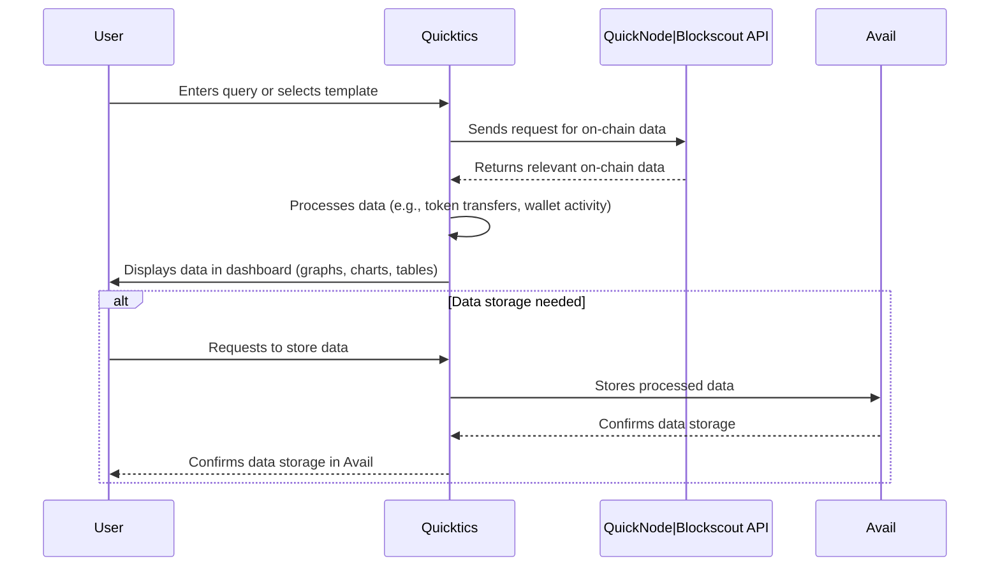

# Quicktics

## Overview
Quicktics is a user-friendly blockchain data analysis platform that allows users to **`easily import`**, **`analyze`**, and **`visualize on-chain data without technical expertise`**. By leveraging the QuickNode, Blockscout API, users can build custom dashboards, analyze data in real-time, and store data using decentralized solutions like Avail. Quicktics is designed to make blockchain insights accessible to both technical and non-technical users, empowering everyone to explore and understand the Web3 ecosystem with ease.

## Problems Quicktics Solves

1. **Complex Blockchain Data**  
   Accessing and interpreting blockchain data often requires deep technical knowledge, such as SQL and smart contract expertise. This makes it difficult for non-technical users and even some developers to extract meaningful insights from on-chain data.

2. **Lack of User-Friendly Tools**  
   Current platforms require users to understand complex query languages like SQL, limiting accessibility to blockchain insights for casual users, businesses, and developers seeking simpler solutions.

3. **Data Storage and Scalability Issues**  
   Storing large volumes of on-chain data is challenging, especially for platforms looking to scale. Traditional centralized solutions have limitations, while decentralized storage options are underutilized.

## Solutions Provided by Quicktics

1. **Simplified Data Access**  
   Quicktics removes the need for SQL or programming knowledge by allowing users to interact with blockchain data via natural language queries and intuitive interfaces. This lowers the barrier to entry for all users.

2. **Customizable Dashboards**  
   Users can easily create personalized dashboards, selecting the data points and visualizations they need to monitor their Web3 activities in real time. This flexibility caters to both casual users and developers.

3. **Decentralized Storage with Avail**  
   By integrating Avail, Quicktics offers a decentralized, scalable solution for storing on-chain data. This ensures efficient data management and scalability for both users and the platform itself.

## Key Points

- **No Coding Required**: Users can query blockchain data and create custom dashboards without needing SQL or other programming skills.
- **Custom Visualizations**: Tailor data presentations with charts, graphs, and other visual formats.
- **Real-Time and Historical Data**: Utilize QuickNode Streams to access real-time and historical on-chain data.
- **Decentralized Storage**: Use Avail to store blockchain data securely and efficiently.
- **Cross-Platform Access**: Accessible via web, mobile app, and future integrations like Telegram mini-apps.

## How It Works (Sequence Diagram)

1. **User Input**: The user enters a query or selects a pre-built template in the Quicktics dashboard.
2. **QuickNode API Interaction**: Quicktics connects to the QuickNode API to retrieve the relevant on-chain data.
3. **Data Processing**: The data is processed based on the user’s query (e.g., token transfers, wallet activity).
4. **Visualization**: The data is displayed in the user’s custom dashboard with graphs, charts, or tables as specified.
5. **Avail Storage (Optional)**: Users can store the analyzed data in Avail for future reference or sharing.

## User Journey

1. **Sign-Up**: The user signs up or logs in to Quicktics through a web browser or mobile app.
2. **Data Query**: The user selects a data type (e.g., wallet activity, token prices) or inputs a natural language query.
3. **Custom Dashboard Creation**: The user customizes the dashboard by adding visual elements like graphs or charts to monitor data.
4. **Real-Time Insights**: Quicktics fetches real-time data from QuickNode Streams and updates the dashboard accordingly.
5. **Data Storage**: If needed, the user stores their dashboard data in Avail for future use or to share with others.
6. **Continuous Monitoring**: The user can return to Quicktics to monitor updated blockchain data in real time or adjust the dashboard as needed.

## Conclusion

Quicktics aims to democratize blockchain data analysis by making it simple, accessible, and customizable for users of all backgrounds. By removing the technical barriers that currently prevent many users from accessing on-chain insights, Quicktics empowers users to fully explore, analyze, and understand the Web3 ecosystem. With decentralized storage, customizable dashboards, and seamless integration with the QuickNode API, Quicktics is set to transform how users interact with blockchain data.
